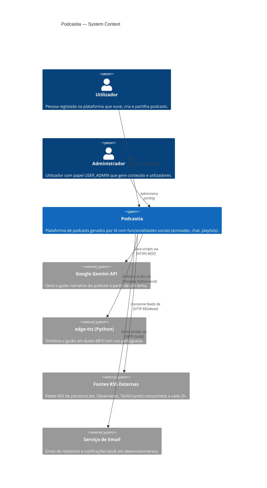
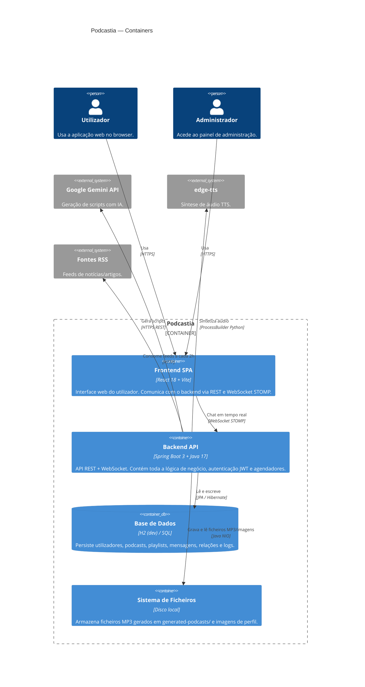
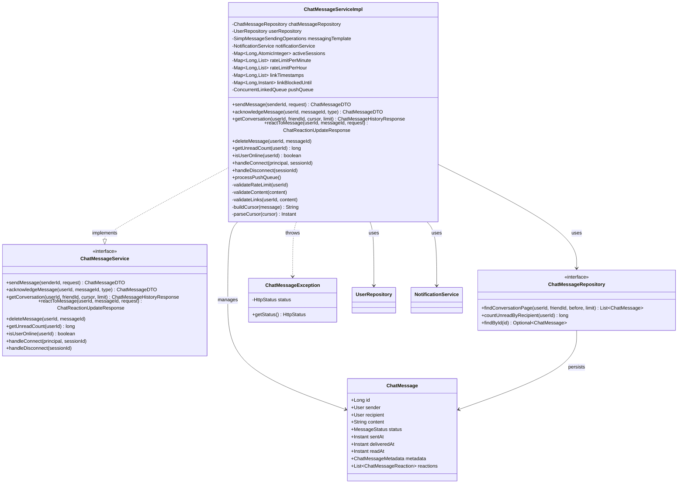
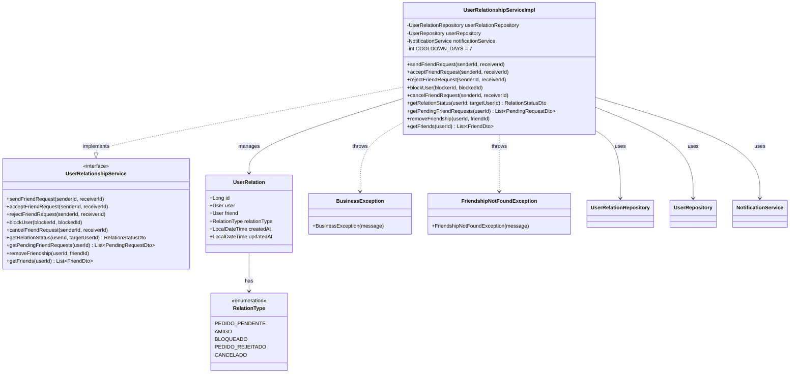
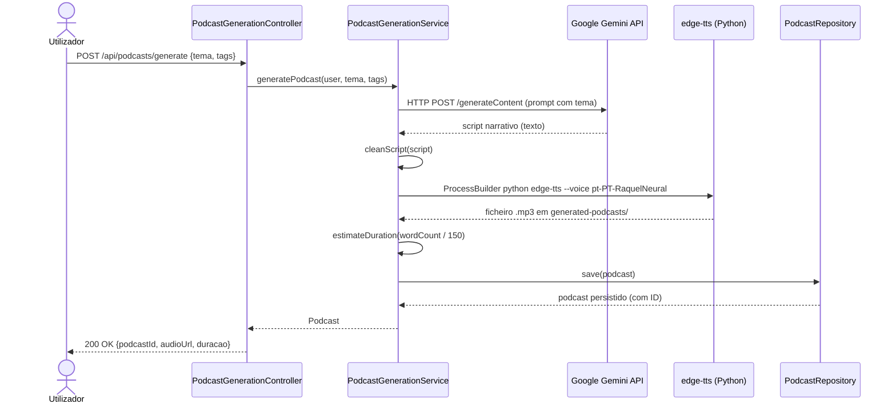

# 🏗️ C4 Model — Podcastia

Documentação de arquitetura em quatro níveis segundo o modelo **C4** (Context, Containers, Components, Code).

Os diagramas são gerados em **Mermaid JS** (níveis 1–3 desenhados manualmente; nível 4 gerado por ferramenta automática — ver secção [Nível 4](#nível-4--code)).

---

## Nível 1 — System Context

> *Quem usa o sistema e com que sistemas externos ele interage?*



---

## Nível 2 — Containers

> *Que aplicações e datastores compõem o sistema?*



---

## Nível 3 — Components

> *Que componentes compõem o container Backend API?*

```mermaid
C4Component
    title Podcastia — Components (Backend API)

    Container_Ext(frontend, "Frontend SPA", "React + Vite", "Chama a API REST e WebSocket.")
    ContainerDb_Ext(db, "Base de Dados", "H2/SQL", "")
    System_Ext(gemini, "Google Gemini API", "")
    System_Ext(edgetts, "edge-tts", "")
    System_Ext(rss, "Fontes RSS", "")

    Container_Boundary(backend, "Backend API — Spring Boot") {

        Component(secConfig, "SecurityConfig + JwtFilter", "Spring Security", "Autenticação JWT stateless. Filtra todos os pedidos e popula o SecurityContext.")

        Component(authCtrl, "AuthController", "REST /api/auth", "Login por email ou username#tag. Devolve token JWT.")
        Component(userCtrl, "UserController + AuthUserController", "REST /users, /api/users", "Registo, perfil próprio (/me), onboarding e alteração de password.")
        Component(podcastCtrl, "PodcastController", "REST /podcasts", "Feed personalizado, progresso de escuta, homepage agregada, CRUD direto.")
        Component(podcastGenCtrl, "PodcastGenerationController", "REST /api/podcasts", "Geração de podcasts com IA. Streaming e download de MP3.")
        Component(feedCtrl, "FeedController", "REST /api/home", "Feed filtrado com JPA Specification (categoria, shorts, favoritos, etc.).")
        Component(playlistCtrl, "PlaylistController", "REST /api/playlists", "CRUD de playlists, adicionar/remover/reordenar episódios, download ZIP.")
        Component(dailyCtrl, "DailyPlaylistController", "REST /api/daily-playlists", "Playlists diárias personalizadas (hoje, última, forçar geração).")
        Component(chatCtrl, "ChatController", "REST /api/chats", "Histórico de mensagens, contagem não lidas, reações, eliminação.")
        Component(chatWsCtrl, "ChatWebSocketController", "STOMP /app/chat.*", "Envio, ACK e reações de mensagens em tempo real.")
        Component(relationCtrl, "UserRelationController", "REST /api/relations", "Pedidos de amizade, aceitar/rejeitar/bloquear, listar amigos.")
        Component(adminCtrl, "AdminController", "REST /api/admin", "Analytics, gestão de podcasts/utilizadores, exportação CSV/PDF, relatórios. (Requer USER_ADMIN)")
        Component(searchCtrl, "SearchController", "REST /api/search", "Pesquisa unificada de utilizadores e podcasts.")
        Component(favCtrl, "PodcastFavoriteController", "REST /api/favorites", "Toggle, verificar e listar favoritos.")
        Component(topicCtrl, "TopicController", "REST /api/topics", "Listar tags e salvar tópicos de interesse.")
        Component(profileCtrl, "ProfileImageController", "REST /api/profile", "Upload, validação (≤5MB JPG/PNG) e redimensionamento de imagem de perfil.")
        Component(regCtrl, "RegistrationApiController", "REST /api/register", "Verificar e gerar tags de utilizador (username#0000–9999).")

        Component(recommendSvc, "RecommendationService", "Spring Service", "Feed personalizado por pontos de tag. Cache 24h por utilizador.")
        Component(feedSvc, "FeedService", "Spring Service", "Filtros dinâmicos com JPA Specification.")
        Component(podcastGenSvc, "PodcastGenerationService", "Spring Service", "Pipeline Gemini API → edge-tts → persistência MP3.")
        Component(playlistSvc, "PlaylistService", "Spring Service", "CRUD playlists, reordenação atómica de episódios.")
        Component(dailySvc, "DailyPlaylistService", "Spring Service", "Geração automática diária por preferências do utilizador.")
        Component(chatSvc, "ChatMessageServiceImpl", "Spring Service", "Rate limiting (20/min, 100/h), link blacklist, push queue, cursor pagination.")
        Component(relationSvc, "UserRelationshipServiceImpl", "Spring Service", "Ciclo de amizades com cooldown de 7 dias. Bloqueios.")
        Component(adminSvc, "AdminService", "Spring Service", "Analytics, export CSV/PDF, relatórios assíncronos, logs de auditoria.")
        Component(rssSvc, "RssService", "Spring Service", "Consome feeds RSS a cada 2h com biblioteca ROME.")
        Component(searchSvc, "SearchService", "Spring Service", "Agregação paginada de utilizadores + podcasts.")
        Component(profileSvc, "ProfileImageService", "Spring Service", "Upload, resize e validação de imagens de perfil.")
        Component(notifSvc, "NotificationService", "Spring Service", "Envio de notificações push (stub stdout em dev).")
        Component(emailSvc, "EmailService", "Spring Service", "Envio de emails (stub stdout em dev).")

        Component(scheduler, "DailyPlaylistScheduler", "Spring @Scheduled", "Regenera playlists diárias às 00:00 Europe/Lisbon.")
        Component(rssScheduler, "RssService @Scheduled", "Spring @Scheduled", "Consome RSS a cada 2 horas.")

        Component(repos, "Repositórios JPA", "Spring Data JPA", "UserRepository, PodcastRepository, ChatMessageRepository, PlaylistRepository, etc. (13 repositórios)")
    }

    Rel(frontend, secConfig, "Todos os pedidos passam por", "JWT Bearer")
    Rel(frontend, authCtrl, "Login")
    Rel(frontend, userCtrl, "Perfil, registo, password")
    Rel(frontend, podcastCtrl, "Feed, progresso, escuta")
    Rel(frontend, podcastGenCtrl, "Gerar, streaming, download")
    Rel(frontend, feedCtrl, "Feed filtrado")
    Rel(frontend, playlistCtrl, "Playlists")
    Rel(frontend, dailyCtrl, "Playlists diárias")
    Rel(frontend, chatCtrl, "Chat REST")
    Rel(frontend, chatWsCtrl, "Chat tempo real", "WebSocket STOMP")
    Rel(frontend, relationCtrl, "Amizades")
    Rel(frontend, adminCtrl, "Admin", "USER_ADMIN only")
    Rel(frontend, searchCtrl, "Pesquisa")
    Rel(frontend, favCtrl, "Favoritos")
    Rel(frontend, topicCtrl, "Tópicos")
    Rel(frontend, profileCtrl, "Imagem perfil")
    Rel(frontend, regCtrl, "Verificar/gerar tag")

    Rel(podcastGenCtrl, podcastGenSvc, "Delega geração")
    Rel(podcastGenSvc, gemini, "Gera script via", "HTTPS")
    Rel(podcastGenSvc, edgetts, "Sintetiza áudio via", "ProcessBuilder")

    Rel(feedCtrl, feedSvc, "Delega filtragem")
    Rel(podcastCtrl, recommendSvc, "Delega recomendação")
    Rel(playlistCtrl, playlistSvc, "Delega CRUD")
    Rel(dailyCtrl, dailySvc, "Delega geração")
    Rel(chatCtrl, chatSvc, "Delega lógica")
    Rel(chatWsCtrl, chatSvc, "Delega lógica")
    Rel(relationCtrl, relationSvc, "Delega relações")
    Rel(adminCtrl, adminSvc, "Delega administração")
    Rel(searchCtrl, searchSvc, "Delega pesquisa")
    Rel(profileCtrl, profileSvc, "Delega imagem")

    Rel(scheduler, dailySvc, "Invoca regeneração")
    Rel(rssSvc, rss, "Consome feeds de", "HTTP RSS")

    Rel(repos, db, "Lê e escreve", "JDBC / JPA")
    Rel(adminSvc, emailSvc, "Envia relatórios por email")
    Rel(relationSvc, notifSvc, "Notifica pedidos de amizade")
```



---

## Nível 4 — Code

> *Detalhe ao nível de classes, métodos e relações entre componentes.*
>
> **O nível 4 deve ser gerado automaticamente a partir do código-fonte.** Recomenda-se o uso de uma das ferramentas abaixo, pois manter diagramas de código manualmente é insustentável.

### Ferramenta recomendada: `jqassistant` + plugin `jqassistant-plantuml-rule`

```bash
# Na pasta servidor/
./mvnw jqassistant:scan jqassistant:analyze jqassistant:report
# Gera diagramas PlantUML/Mermaid de dependências entre pacotes e classes
```

### Alternativa: `Structurizr Lite` (Docker)

```bash
docker run -it --rm -p 8080:8080 \
  -v "$(pwd)/documentacao/structurizr:/usr/local/structurizr" \
  structurizr/lite
# Abre http://localhost:8080 — suporta export para Mermaid e PlantUML
```

### Alternativa: IntelliJ IDEA — Diagrama UML automático

1. Clique direito num pacote → **Diagrams → Show Diagram → Java Class Diagram**
2. Exportar como SVG/PNG

---

### Exemplo de diagrama Nível 4 — Componente `ChatMessageServiceImpl`

> Gerado a partir da análise manual das dependências do serviço de chat.



---

### Exemplo de diagrama Nível 4 — Componente `UserRelationshipServiceImpl`



---

### Exemplo de diagrama Nível 4 — Pipeline de Geração de Podcasts



---

## Sumário das Decisões Arquiteturais

| Decisão | Escolha | Justificação |
| :--- | :--- | :--- |
| **Autenticação** | JWT stateless (24h) | Sem estado no servidor; escalável horizontalmente |
| **Chat em tempo real** | WebSocket STOMP | Bidirecional; integra com Spring Messaging |
| **ORM** | JPA / Hibernate + H2 | Desenvolvimento rápido; fácil migração para PostgreSQL/MySQL |
| **Filtros de feed** | JPA Specification | Queries dinâmicas sem concatenação SQL |
| **Geração de áudio** | edge-tts via ProcessBuilder | TTS gratuito, voz portuguesa nativa |
| **Geração de script** | Google Gemini API | LLM com boa qualidade em português |
| **Cache de feed** | In-memory `ConcurrentHashMap` (24h) | Simples; substituível por Redis em produção |
| **Playlists diárias** | `@Scheduled` cron à meia-noite | Operação leve; sem necessidade de job queue |
| **Consumo RSS** | ROME Library + `@Scheduled` 2h | Abstrai diferenças RSS 1.0/2.0/Atom |
| **Segurança admin** | `@PreAuthorize("hasRole('USER_ADMIN')")` | Declarativo; verificado antes da lógica de negócio |
