```mermaid
classDiagram
    direction TB

    %% ─── ENUMERAÇÕES ───────────────────────────────────────────────────
    class PodcastTag {
        <<enumeration>>
        DESPORTO
        POLITICA
        FINANCAS
        GERAL
    }

    class UserType {
        <<enumeration>>
        USERNORMAL
        USERADMIN
    }

    class UserStatus {
        <<enumeration>>
        ACTIVE
        SUSPENDED
        BANNED
    }

    class RelationType {
        <<enumeration>>
        AMIGO
        BLOQUEADO
        PEDIDO
        PEDIDO_REJEITADO
        CANCELADO
    }

    class MessageStatus {
        <<enumeration>>
        SENT
        DELIVERED
        READ
    }

    class ReactionEmoji {
        <<enumeration>>
        THUMBS_UP : 👍
        HEART : ❤️
        LAUGH : 😂
        SURPRISED : 😮
        SAD : 😢
        FIRE : 🔥
        +isAllowed(emoji) bool
    }

    class AdminActionType {
        <<enumeration>>
        BAN_USER
        SUSPEND_USER
        ACTIVATE_USER
        DELETE_PODCAST
        FEATURE_PODCAST
        HIDE_PODCAST
        EXPORT_DATA
    }

    %% ─── ENTIDADES PRINCIPAIS ───────────────────────────────────────────
    class User {
        +Long id
        +String username
        +String tag
        +String email
        +String password
        +String bio
        +String profilePicturePath
        +UserType userType
        +UserStatus status
        +int pontosDesporto
        +int pontosPolitica
        +int pontosFinancas
        +int pontosGeral
        +float playbackSpeed
        +boolean hasCompletedOnboarding
        +LocalDateTime createdAt
        +LocalDateTime lastActiveAt
        +List~PodcastTag~ topics
        +onCreate()
    }

    class Podcast {
        +Long id
        +String titulo
        +int duracao
        +String conteudoPath
        +String coverImagePath
        +boolean publico
        +boolean available
        +boolean explicitContent
        +boolean hidden
        +boolean featured
        +LocalDateTime createdAt
        +LocalDateTime lastModified
        +List~PodcastTag~ tags
        +onCreate()
    }

    class UserRelation {
        +Long id
        +User user
        +User friend
        +RelationType type
        +LocalDateTime createdAt
        +LocalDateTime updatedAt
        +getSender() User
        +getReceiver() User
        +onUpdate()
    }

    class ChatMessage {
        +Long id
        +User sender
        +User recipient
        +String content
        +MessageStatus status
        +Instant createdAt
        +Instant deliveredAt
        +Instant readAt
        +ChatMessageMetadata metadata
        +List~ChatMessageReaction~ reactions
        +onCreate()
    }

    class ChatMessageMetadata {
        <<Embeddable>>
        +String type
        +Long podcastId
        +Long episodeId
    }

    class ChatMessageReaction {
        +Long id
        +ChatMessage message
        +User user
        +String emoji
        +Instant clientEventAt
        +Instant createdAt
        +Instant updatedAt
        +onCreate()
        +onUpdate()
    }

    class Playlist {
        +Long id
        +String title
        +String description
        +String coverImagePath
        +boolean isPublic
        +User owner
        +List~PlaylistItem~ items
        +LocalDateTime createdAt
        +LocalDateTime updatedAt
        +onCreate()
        +onUpdate()
    }

    class PlaylistItem {
        +Long id
        +Playlist playlist
        +Podcast podcast
        +int position
    }

    class DailyPlaylist {
        +Long id
        +User user
        +LocalDate playlistDate
        +String title
        +String description
        +int totalDuration
        +int totalPodcasts
        +List~DailyPlaylistItem~ items
        +LocalDateTime createdAt
        +LocalDateTime updatedAt
        +onCreate()
        +onUpdate()
    }

    class DailyPlaylistItem {
        +Long id
        +DailyPlaylist dailyPlaylist
        +Podcast podcast
        +int position
    }

    class PodcastFavorite {
        +Long id
        +User user
        +Podcast podcast
        +LocalDateTime createdAt
    }

    class PodcastProgress {
        +Long id
        +User user
        +Podcast podcast
        +int progressSeconds
        +LocalDateTime lastListenedAt
    }

    class RssSource {
        +Long id
        +String nome
        +String url
        +boolean ativa
    }

    class Article {
        +Long id
        +String titulo
        +String url
        +String descricao
        +String fonte
        +LocalDateTime publicadoEm
        +LocalDateTime importadoEm
    }

    class AdminActionLog {
        +Long id
        +User admin
        +AdminActionType actionType
        +String targetType
        +Long targetId
        +String details
        +LocalDateTime createdAt
    }

    %% ─── RELAÇÕES ───────────────────────────────────────────────────────
    User "1" --> "0..*" Podcast : cria
    User "1" --> "0..*" UserRelation : inicia (user)
    User "1" --> "0..*" UserRelation : recebe (friend)
    User "1" --> "0..*" ChatMessage : envia (sender)
    User "1" --> "0..*" ChatMessage : recebe (recipient)
    User "1" --> "0..*" ChatMessageReaction : reage
    User "1" --> "0..*" Playlist : possui (owner)
    User "1" --> "0..*" DailyPlaylist : tem
    User "1" --> "0..*" PodcastFavorite : marca
    User "1" --> "0..*" PodcastProgress : regista
    User "1" --> "0..*" AdminActionLog : executa

    Podcast "1" --> "0..*" PlaylistItem : incluído em
    Podcast "1" --> "0..*" DailyPlaylistItem : incluído em
    Podcast "1" --> "0..*" PodcastFavorite : favoritado por
    Podcast "1" --> "0..*" PodcastProgress : progresso de

    ChatMessage "1" *-- "1" ChatMessageMetadata : embeds
    ChatMessage "1" *-- "0..*" ChatMessageReaction : tem

    Playlist "1" *-- "0..*" PlaylistItem : contém
    DailyPlaylist "1" *-- "0..*" DailyPlaylistItem : contém

    PlaylistItem --> Podcast : referencia
    DailyPlaylistItem --> Podcast : referencia

    User --> UserType : tem
    User --> UserStatus : tem
    User --> PodcastTag : interessa-se por
    Podcast --> PodcastTag : categorizado por
    UserRelation --> RelationType : tem
    ChatMessage --> MessageStatus : tem
    ChatMessageReaction --> ReactionEmoji : usa
    AdminActionLog --> AdminActionType : descreve
```

# C4 Nível 4 — Modelo de Domínio (Entidades JPA)

> Gerado a partir da leitura directa do código-fonte em `com.jep.servidor.model`.  
> Representa todas as entidades JPA, os seus campos, enumerações e relações.

---

---

## Tabelas e Restrições Principais

| Entidade | Tabela | Unicidade |
|---|---|---|
| `User` | `users` | `email`; `(username, tag)` |
| `Podcast` | `podcasts` | — (índices em `user_id`, `duracao`) |
| `UserRelation` | `user_relations` | `(user_id, friend_id)` |
| `ChatMessage` | `chat_messages` | — (índices em `sender_id`, `recipient_id`, `created_at`, `status`) |
| `ChatMessageReaction` | `chat_message_reactions` | `(message_id, user_id)` |
| `Playlist` | `playlists` | — (índices em `owner_id`, `is_public`) |
| `PlaylistItem` | `playlist_items` | `(playlist_id, podcast_id)`; `(playlist_id, position)` |
| `DailyPlaylist` | `daily_playlists` | `(user_id, playlist_date)` |
| `PodcastFavorite` | `podcast_favorites` | — |
| `PodcastProgress` | `podcast_progress` | — |
| `RssSource` | `rss_sources` | `url` |
| `AdminActionLog` | `admin_action_logs` | — |
