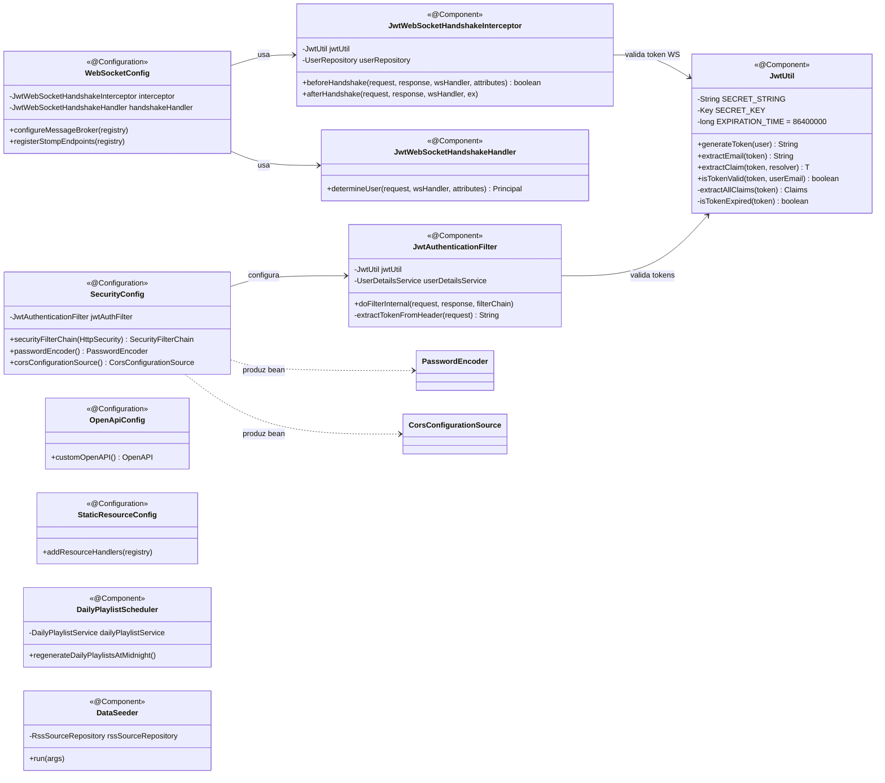
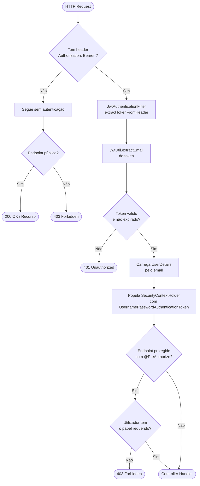
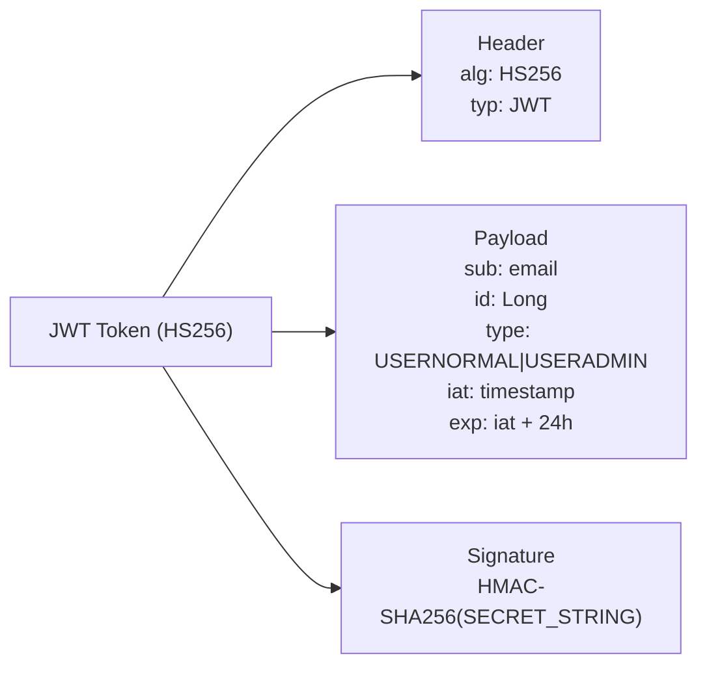

# C4 Nível 4 — Camada de Segurança

> Gerado a partir da leitura directa do código-fonte em `com.jep.servidor.config`.  
> Representa o fluxo JWT, filtros de autenticação, configuração de segurança e WebSocket.

---

## Diagrama de Classes — Segurança



---

## Fluxo de Autenticação JWT — Pedido REST



---

## Fluxo de Autenticação WebSocket

```mermaid
flowchart TD
    A([WS Handshake\nGET /ws?token=JWT]) --> B[JwtWebSocketHandshakeInterceptor\nbeforeHandshake]
    B --> C[JwtUtil.extractEmail\ndo parâmetro token]
    C --> D{Token válido?}
    D -- Não --> E([403 — Handshake recusado])
    D -- Sim --> F[Carrega User pelo email]
    F --> G[Guarda user nos\nwebsocket session attributes]
    G --> H[JwtWebSocketHandshakeHandler\ndetermineUser → Principal]
    H --> I([Ligação STOMP estabelecida])
    I --> J[/user/queue/messages\nfila pessoal activa]
```

---

## Endpoints Públicos (sem JWT)

| Padrão | Motivo |
|---|---|
| `OPTIONS /**` | Preflight CORS |
| `/api/auth/**` | Login |
| `/users`, `/users/**`, `/api/users/**` | Registo e perfis |
| `/api/register/**` | Gerar/verificar tag |
| `/api/search/**` | Pesquisa pública |
| `GET /api/podcasts`, `GET /api/podcasts/**` | Listagem pública de podcasts |
| `GET /podcasts`, `GET /podcasts/**` | PodcastController endpoints públicos |
| `/images/**`, `/audio/**` | Recursos estáticos |
| `/ws/**` | Handshake WebSocket (auth por token na query string) |
| `/h2-console/**` | Consola H2 (apenas dev) |
| `/v3/api-docs/**`, `/swagger-ui/**` | Documentação OpenAPI |
| `/error` | Página de erro Spring |

## Estrutura do Token JWT


