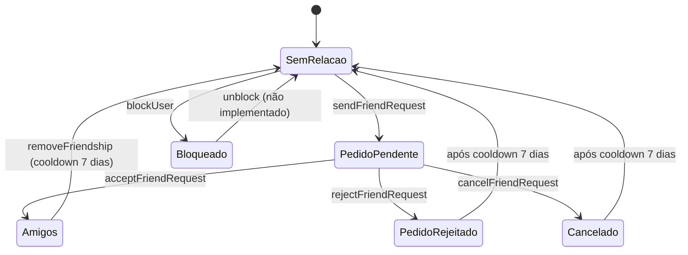

# C4 Nível 4 — Camada de Serviço

> Gerado a partir da leitura directa do código-fonte em `com.jep.servidor.service` e `com.jep.servidor.service.impl`.  
> Representa interfaces, implementações, dependências e responsabilidades de cada serviço.

---

## Diagrama de Classes — Serviços e Interfaces

```mermaid
classDiagram
    direction TB

    %% ─── INTERFACES ─────────────────────────────────────────────────────
    class ChatMessageService {
        <<interface>>
        +sendMessage(senderId, request) ChatMessageDTO
        +acknowledgeMessage(userId, messageId, type) ChatMessageDTO
        +getConversation(userId, friendId, cursor, limit) ChatMessageHistoryResponse
        +reactToMessage(userId, messageId, request) ChatReactionUpdateResponse
        +deleteMessage(userId, messageId)
        +getUnreadCount(userId) long
        +isUserOnline(userId) boolean
        +handleConnect(principal, sessionId)
        +handleDisconnect(sessionId)
    }

    class UserRelationshipService {
        <<interface>>
        +sendFriendRequest(senderId, receiverId)
        +acceptFriendRequest(senderId, receiverId)
        +rejectFriendRequest(senderId, receiverId)
        +blockUser(blockerId, blockedId)
        +cancelFriendRequest(senderId, receiverId)
        +getRelationStatus(userId, targetId) RelationStatusDto
        +getPendingFriendRequests(userId) List~PendingRequestDto~
        +removeFriendship(userId, friendId)
        +getFriends(userId) List~FriendDto~
    }

    class NotificationService {
        <<interface>>
        +sendFriendRequestNotification(senderId, receiverId)
        +sendFriendAcceptedNotification(userId, friendId)
    }

    %% ─── IMPLEMENTAÇÕES ─────────────────────────────────────────────────
    class ChatMessageServiceImpl {
        <<@Service>>
        -ChatMessageRepository chatMessageRepository
        -UserRepository userRepository
        -SimpMessageSendingOperations messagingTemplate
        -NotificationService notificationService
        -Map~Long,AtomicInteger~ activeSessions
        -Map~Long,List~Instant~~ rateLimitPerMinute
        -Map~Long,List~Instant~~ rateLimitPerHour
        -Map~Long,List~Instant~~ linkTimestamps
        -Map~Long,Instant~ linkBlockedUntil
        -ConcurrentLinkedQueue pushQueue
        +sendMessage(senderId, request) ChatMessageDTO
        +acknowledgeMessage(userId, messageId, type) ChatMessageDTO
        +getConversation(userId, friendId, cursor, limit) ChatMessageHistoryResponse
        +reactToMessage(userId, messageId, request) ChatReactionUpdateResponse
        +deleteMessage(userId, messageId)
        +getUnreadCount(userId) long
        +isUserOnline(userId) boolean
        +handleConnect(principal, sessionId)
        +handleDisconnect(sessionId)
        -validateRateLimit(userId)
        -validateContent(content)
        -validateLinks(userId, content)
        -buildCursor(message) String
        -parseCursor(cursor) Instant
        +processPushQueue()
    }

    class UserRelationshipServiceImpl {
        <<@Service>>
        -UserRelationRepository userRelationRepository
        -UserRepository userRepository
        -NotificationService notificationService
        -int COOLDOWN_DAYS = 7
        +sendFriendRequest(senderId, receiverId)
        +acceptFriendRequest(senderId, receiverId)
        +rejectFriendRequest(senderId, receiverId)
        +blockUser(blockerId, blockedId)
        +cancelFriendRequest(senderId, receiverId)
        +getRelationStatus(userId, targetId) RelationStatusDto
        +getPendingFriendRequests(userId) List~PendingRequestDto~
        +removeFriendship(userId, friendId)
        +getFriends(userId) List~FriendDto~
        -isInCooldown(relation) boolean
    }

    class NotificationServiceImpl {
        <<@Service>>
        +sendFriendRequestNotification(senderId, receiverId)
        +sendFriendAcceptedNotification(userId, friendId)
    }

    %% ─── SERVIÇOS CONCRETOS (sem interface própria) ─────────────────────
    class PodcastGenerationService {
        <<@Service>>
        -PodcastRepository podcastRepository
        -String geminiApiKey
        -String generatedPodcastsDir
        +generatePodcast(user, tema, tags) Podcast
        -callGeminiApi(prompt) String
        -cleanScript(script) String
        -runEdgeTts(script, outputPath)
        -estimateDuration(wordCount) int
        -generateFileName(titulo) String
    }

    class RecommendationService {
        <<@Service>>
        -PodcastRepository podcastRepository
        -UserRepository userRepository
        -Map~Long,List~Podcast~~ cache
        -Map~Long,LocalDateTime~ cacheExpiry
        +getRecommendedFeed(user, pageable) Page~Podcast~
        +incrementPoints(userId, tag)
        +invalidateCache(userId)
        -buildRecommendedList(user) List~Podcast~
        -scoreByAfinity(podcast, user) int
    }

    class FeedService {
        <<@Service>>
        -PodcastRepository podcastRepository
        -PodcastFavoriteRepository favoriteRepository
        -PodcastProgressRepository progressRepository
        +getFilteredFeed(user, type, category, isFavorite, maxDuration, hidePlayed, shorts, pageable) Page~Podcast~
        +categoryHasContent(category) boolean
        -buildSpecification(user, type, category, isFavorite, maxDuration, hidePlayed, shorts) Specification~Podcast~
    }

    class DailyPlaylistService {
        <<@Service>>
        -UserRepository userRepository
        -PodcastRepository podcastRepository
        -DailyPlaylistRepository dailyPlaylistRepository
        -DailyPlaylistItemRepository dailyPlaylistItemRepository
        +generateOrUpdateDailyPlaylist(user) DailyPlaylist
        +getDailyPlaylistForToday(userId) Optional~DailyPlaylist~
        +getLatestDailyPlaylist(userId) Optional~DailyPlaylist~
        +regenerateAllDailyPlaylists()
        -selectPodcastsForUser(user) List~Podcast~
        -sortByAfinity(podcasts, user) List~Podcast~
    }

    class PlaylistService {
        <<@Service>>
        -PlaylistRepository playlistRepository
        -PlaylistItemRepository playlistItemRepository
        -PodcastRepository podcastRepository
        -UserRepository userRepository
        +createPlaylist(userId, request) Playlist
        +getPlaylist(playlistId, userId) Playlist
        +getUserPlaylists(userId) List~Playlist~
        +updatePlaylist(playlistId, userId, request) Playlist
        +deletePlaylist(playlistId, userId)
        +addEpisode(playlistId, podcastId, userId) PlaylistItem
        +removeEpisode(playlistId, podcastId, userId)
        +reorderEpisodes(playlistId, userId, orderedIds)
        +getPublicPlaylistsFromFriends(userId) List~Playlist~
    }

    class AdminService {
        <<@Service>>
        -UserRepository userRepository
        -PodcastRepository podcastRepository
        -AdminActionLogRepository logRepository
        -EmailService emailService
        +getAnalytics() AdminAnalyticsDTO
        +banUser(adminId, userId, reason)
        +suspendUser(adminId, userId, reason)
        +activateUser(adminId, userId)
        +deletePodcast(adminId, podcastId, reason)
        +featurePodcast(adminId, podcastId)
        +hidePodcast(adminId, podcastId)
        +getActionLogs(pageable) Page~AdminActionLog~
        +exportUsersCSV() byte[]
        +exportPodcastsPDF() byte[]
        +generateReport() AdminReportDTO
        -logAction(admin, type, targetType, targetId, details)
    }

    class RssService {
        <<@Service>>
        -RssSourceRepository rssSourceRepository
        -ArticleRepository articleRepository
        +fetchAllFeeds()
        -fetchFeed(source) List~Article~
        -parseRome(url) SyndFeed
        -isDuplicate(url) boolean
    }

    class SearchService {
        <<@Service>>
        -UserRepository userRepository
        -PodcastRepository podcastRepository
        +searchUnified(query, page, size) List~SearchResultDto~
        -searchUsers(query, pageable) List~SearchResultDto~
        -searchPodcasts(query, pageable) List~SearchResultDto~
    }

    class ProfileImageService {
        <<@Service>>
        -String uploadDir
        +validate(file)
        +store(file) String
        +deleteOldImage(path)
        -resize(file) BufferedImage
        -detectFormat(file) String
    }

    class EmailService {
        <<@Service>>
        +sendReport(to, subject, body)
        +sendNotification(to, subject, body)
    }

    %% ─── RELAÇÕES DE IMPLEMENTAÇÃO ──────────────────────────────────────
    ChatMessageServiceImpl ..|> ChatMessageService : implements
    UserRelationshipServiceImpl ..|> UserRelationshipService : implements
    NotificationServiceImpl ..|> NotificationService : implements

    %% ─── DEPENDÊNCIAS ENTRE SERVIÇOS ────────────────────────────────────
    ChatMessageServiceImpl --> NotificationService : notifica
    UserRelationshipServiceImpl --> NotificationService : notifica
    AdminService --> EmailService : envia relatórios
    DailyPlaylistService --> RecommendationService : usa pontos
```



---

## Regras de Negócio Chave

### `ChatMessageServiceImpl` — Rate Limiting
```
Por utilizador:
  - máx 20 mensagens / minuto
  - máx 100 mensagens / hora
  - máx 3 links / hora → bloqueia envio de links por 1h se excedido
Conteúdo: máx 2000 caracteres, sem conteúdo vazio
```

### `UserRelationshipServiceImpl` — Cooldown


### `RecommendationService` — Pontuação por Afinidade
```
cache válida 24h por userId
pontos por tag:
  DESPORTO  → pontosDesporto
  POLITICA  → pontosPolitica
  FINANCAS  → pontosFinancas
  GERAL     → pontosGeral
score = soma dos pontos das tags do podcast para o utilizador
ordem = score DESC, createdAt DESC
```
