# C4 Nível 4 — Camada de Repositórios (Spring Data JPA)

> Gerado a partir da leitura directa do código-fonte em `com.jep.servidor.repository`.  
> Representa todos os repositórios, as suas hierarquias e as queries JPQL personalizadas.

---

## Diagrama de Classes — Repositórios

```mermaid
classDiagram
    direction TB

    %% ─── BASE SPRING DATA ───────────────────────────────────────────────
    class JpaRepository~T,ID~ {
        <<Spring Data>>
        +findAll() List~T~
        +findById(id) Optional~T~
        +save(entity) T
        +delete(entity)
        +count() long
    }

    class JpaSpecificationExecutor~T~ {
        <<Spring Data>>
        +findAll(spec, pageable) Page~T~
        +findOne(spec) Optional~T~
        +count(spec) long
    }

    %% ─── REPOSITÓRIOS ───────────────────────────────────────────────────
    class UserRepository {
        <<interface>>
        +existsByEmail(email) boolean
        +existsByUsernameAndTag(username, tag) boolean
        +findByEmail(email) Optional~User~
        +findByUsername(username) Optional~User~
        +findByUsernameAndTag(username, tag) Optional~User~
        +findByUsernameContainingIgnoreCaseOrEmailContainingIgnoreCase(u, e) List~User~
        +findByUsernameContainingIgnoreCase(username, pageable) List~User~
        +countFriendships(userId) long
        +countByLastActiveAtAfter(dateTime) long
        +countByCreatedAtAfter(dateTime) long
        +countByLastActiveAtBetween(start, end) long
        +countByCreatedAtBetween(start, end) long
    }

    class PodcastRepository {
        <<interface>>
        +findByUser(user) List~Podcast~
        +findByUserOrderByCreatedAtDesc(user) List~Podcast~
        +findByTituloContainingIgnoreCaseOrUser_UsernameContainingIgnoreCase(t, u, p) List~Podcast~
        +existsByTag(tag) boolean
        +findAllByPublicoTrueAndAvailableTrue() List~Podcast~
    }

    class UserRelationRepository {
        <<interface>>
        +findByUser(user) List~UserRelation~
        +findByUserAndType(user, type) List~UserRelation~
        +findByFriendIdAndType(friendId, type) List~UserRelation~
        +findRelationship(userId1, userId2) Optional~UserRelation~
    }

    class ChatMessageRepository {
        <<interface>>
        +findConversationPage(userId, friendId, cursorCreatedAt, cursorId, pageable) List~ChatMessage~
        +countUnreadMessages(userId) long
    }

    class ChatMessageReactionRepository {
        <<interface>>
        +findByMessageIdAndUserId(messageId, userId) Optional~ChatMessageReaction~
        +findByMessageId(messageId) List~ChatMessageReaction~
    }

    class PlaylistRepository {
        <<interface>>
        +findByOwnerOrderByUpdatedAtDesc(owner) List~Playlist~
        +findByOwnerIdAndIsPublicTrueOrderByUpdatedAtDesc(ownerId) List~Playlist~
        +findPublicPlaylistsFromFriends(userId) List~Playlist~
    }

    class PlaylistItemRepository {
        <<interface>>
        +findByPlaylistOrderByPositionAsc(playlist) List~PlaylistItem~
        +findByPlaylistAndPodcast(playlist, podcast) Optional~PlaylistItem~
        +deleteByPlaylistAndPodcast(playlist, podcast)
    }

    class DailyPlaylistRepository {
        <<interface>>
        +findByUserAndPlaylistDate(user, date) Optional~DailyPlaylist~
        +findFirstByUserOrderByPlaylistDateDesc(user) Optional~DailyPlaylist~
        +deleteByUserAndPlaylistDate(user, date)
    }

    class DailyPlaylistItemRepository {
        <<interface>>
        +findByDailyPlaylist(dailyPlaylist) List~DailyPlaylistItem~
        +deleteByDailyPlaylist(dailyPlaylist)
    }

    class PodcastFavoriteRepository {
        <<interface>>
        +findPodcastIdsByUser(user) List~Long~
        +existsByUserAndPodcast(user, podcast) boolean
        +findByUserAndPodcast(user, podcast) Optional~PodcastFavorite~
        +deleteByUserAndPodcast(user, podcast)
    }

    class PodcastProgressRepository {
        <<interface>>
        +findByUserAndPodcast(user, podcast) Optional~PodcastProgress~
        +findByUser(user) List~PodcastProgress~
        +findRecentlyListenedByUser(userId, pageable) List~PodcastProgress~
        +existsByUserAndPodcast(user, podcast) boolean
    }

    class RssSourceRepository {
        <<interface>>
        +findByAtiva(ativa) List~RssSource~
    }

    class ArticleRepository {
        <<interface>>
        +existsByUrl(url) boolean
        +findByFonte(fonte) List~Article~
    }

    class AdminActionLogRepository {
        <<interface>>
        +findByAdminOrderByCreatedAtDesc(admin, pageable) Page~AdminActionLog~
        +findByActionType(actionType) List~AdminActionLog~
    }

    %% ─── HERANÇA ────────────────────────────────────────────────────────
    JpaRepository <|.. UserRepository
    JpaRepository <|.. UserRelationRepository
    JpaRepository <|.. ChatMessageRepository
    JpaRepository <|.. ChatMessageReactionRepository
    JpaRepository <|.. PlaylistRepository
    JpaRepository <|.. PlaylistItemRepository
    JpaRepository <|.. DailyPlaylistRepository
    JpaRepository <|.. DailyPlaylistItemRepository
    JpaRepository <|.. PodcastFavoriteRepository
    JpaRepository <|.. PodcastProgressRepository
    JpaRepository <|.. RssSourceRepository
    JpaRepository <|.. ArticleRepository
    JpaRepository <|.. AdminActionLogRepository
    JpaRepository <|.. PodcastRepository
    JpaSpecificationExecutor <|.. PodcastRepository
```



---

## Queries JPQL Personalizadas

### `UserRepository.countFriendships`
```sql
SELECT COUNT(r) FROM UserRelation r
WHERE (r.user.id = :userId OR r.friend.id = :userId)
  AND r.type = 'AMIGO'
-- Nota: conta registos em ambas as direções (bidireccional)
-- Dividir por 2 para nº real de amigos únicos
```

### `UserRelationRepository.findRelationship`
```sql
SELECT r FROM UserRelation r
WHERE r.user.id = :userId1 AND r.friend.id = :userId2
-- Direcional: apenas A→B; chamar com ids invertidos para B→A
```

### `ChatMessageRepository.findConversationPage`
```sql
SELECT m FROM ChatMessage m
WHERE ((m.sender.id = :userId AND m.recipient.id = :friendId)
    OR (m.sender.id = :friendId AND m.recipient.id = :userId))
  AND (:cursorCreatedAt IS NULL
    OR m.createdAt < :cursorCreatedAt
    OR (m.createdAt = :cursorCreatedAt AND m.id < :cursorId))
ORDER BY m.createdAt DESC, m.id DESC
-- Cursor-based pagination: usa (createdAt, id) como cursor composto
```

### `ChatMessageRepository.countUnreadMessages`
```sql
SELECT COUNT(m) FROM ChatMessage m
WHERE m.recipient.id = :userId AND m.status != 'READ'
```

### `PodcastRepository.existsByTag`
```sql
SELECT count(p) > 0 FROM Podcast p
JOIN p.tags t WHERE t = :tag
```

### `PlaylistRepository.findPublicPlaylistsFromFriends`
```sql
SELECT p FROM Playlist p
WHERE p.isPublic = true
  AND p.owner.id IN (
    SELECT CASE WHEN r.user.id = :userId THEN r.friend.id ELSE r.user.id END
    FROM UserRelation r
    WHERE (r.user.id = :userId OR r.friend.id = :userId)
      AND r.type = 'AMIGO'
  )
ORDER BY p.updatedAt DESC
```

---

## Mapa: Serviço → Repositórios utilizados

| Serviço | Repositórios |
|---|---|
| `ChatMessageServiceImpl` | `ChatMessageRepository`, `ChatMessageReactionRepository`, `UserRepository` |
| `UserRelationshipServiceImpl` | `UserRelationRepository`, `UserRepository` |
| `PodcastGenerationService` | `PodcastRepository`, `UserRepository` |
| `RecommendationService` | `PodcastRepository`, `UserRepository` |
| `FeedService` | `PodcastRepository` (+ Specification), `PodcastFavoriteRepository`, `PodcastProgressRepository` |
| `DailyPlaylistService` | `UserRepository`, `PodcastRepository`, `DailyPlaylistRepository`, `DailyPlaylistItemRepository` |
| `PlaylistService` | `PlaylistRepository`, `PlaylistItemRepository`, `PodcastRepository`, `UserRepository` |
| `AdminService` | `UserRepository`, `PodcastRepository`, `AdminActionLogRepository` |
| `RssService` | `RssSourceRepository`, `ArticleRepository` |
| `SearchService` | `UserRepository`, `PodcastRepository` |
| `ProfileImageService` | `UserRepository` |
