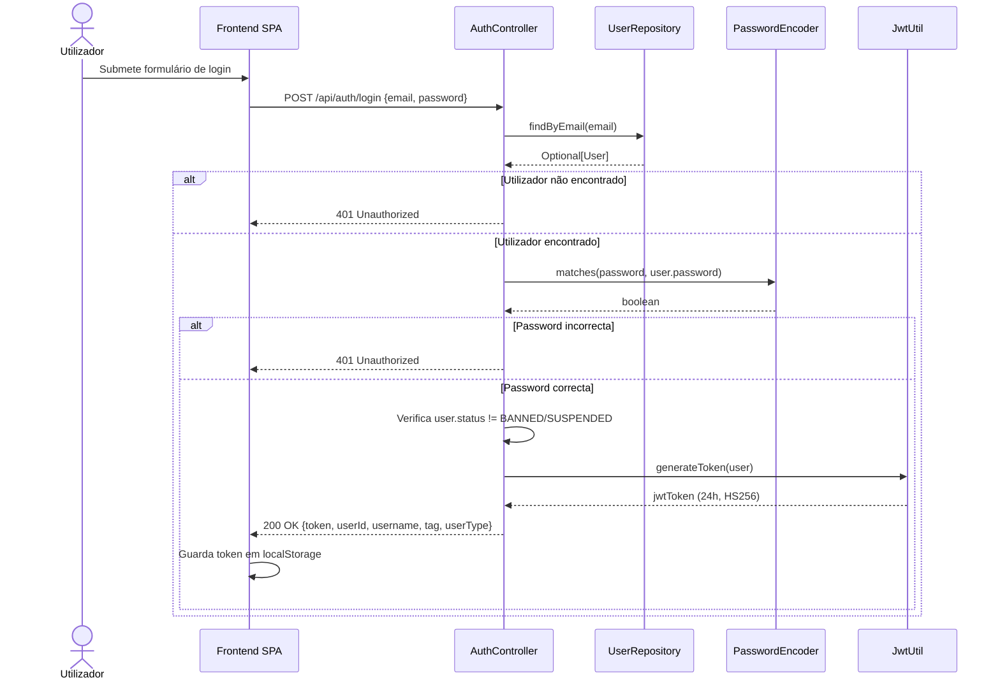
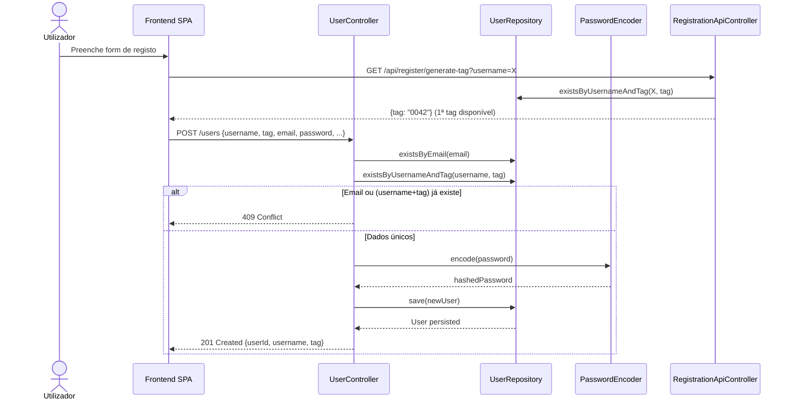
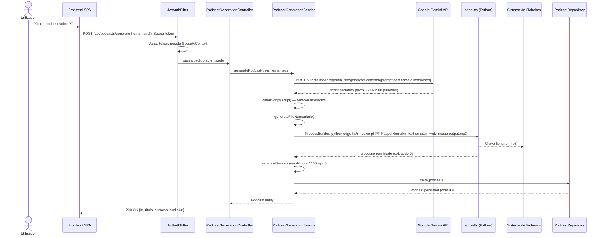
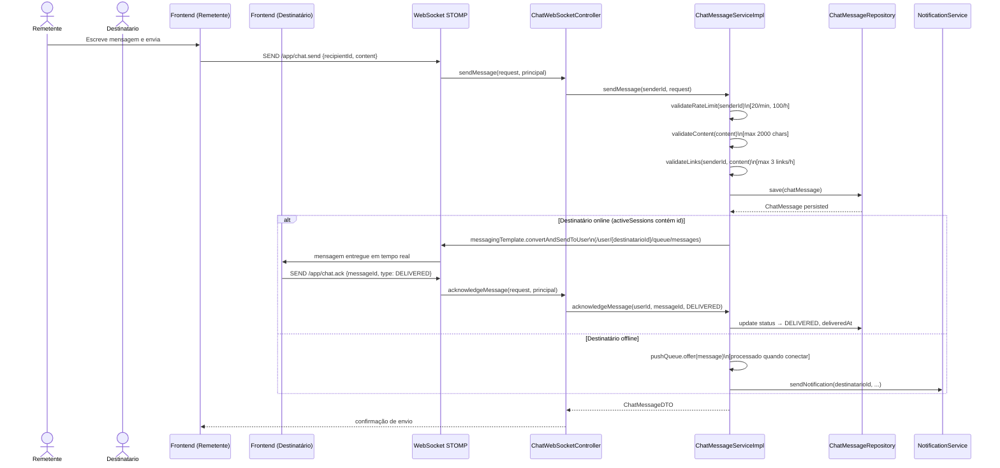
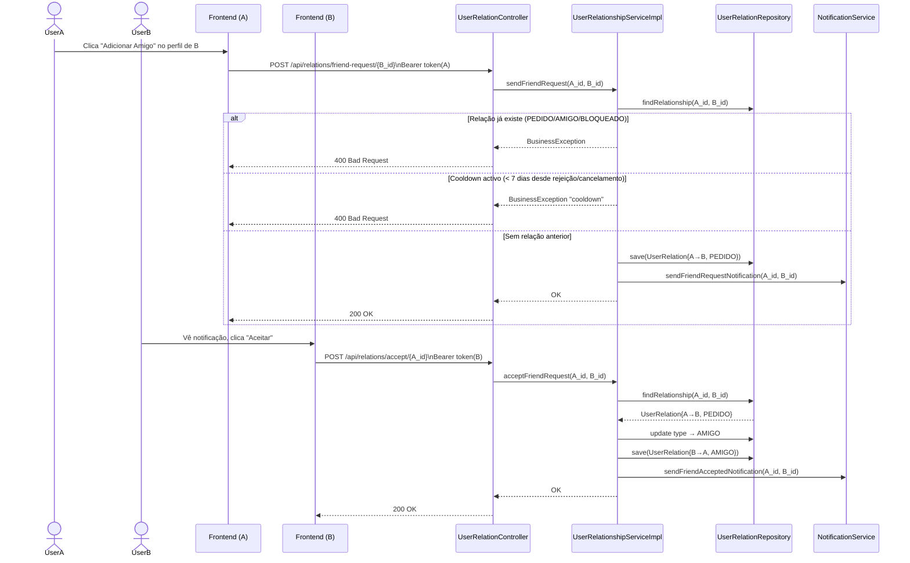
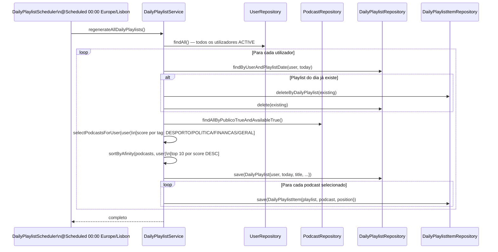
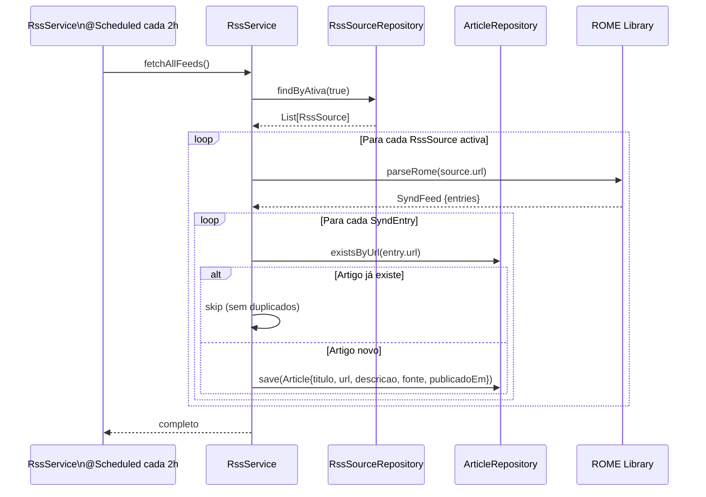
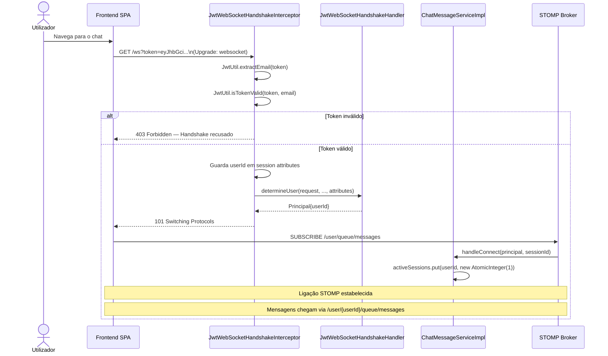

# C4 Nível 4 — Diagramas de Sequência (Fluxos Principais)

> Gerado a partir da leitura directa do código-fonte.  
> Representa os fluxos end-to-end mais importantes do sistema Podcastia.

---

## 1. Login e Emissão de JWT

---

## 2. Registo de Utilizador

---

## 3. Geração de Podcast com IA

---

## 4. Ciclo de Mensagem de Chat (WebSocket)

---

## 5. Ciclo de Pedido de Amizade

---

## 6. Geração Automática de Playlist Diária (Scheduler)

---

## 7. Consumo de RSS (Scheduler)

---

## 8. Autenticação WebSocket + Chat em Tempo Real

